# MelodyHub - Arquitetura DDD e Observabilidade

API de streaming de música construída com **Spring Boot 3.3.0** e **Kotlin**, aplicando Domain-Driven Design (DDD), Clean Architecture e SOLID.

## Stack Tecnológica

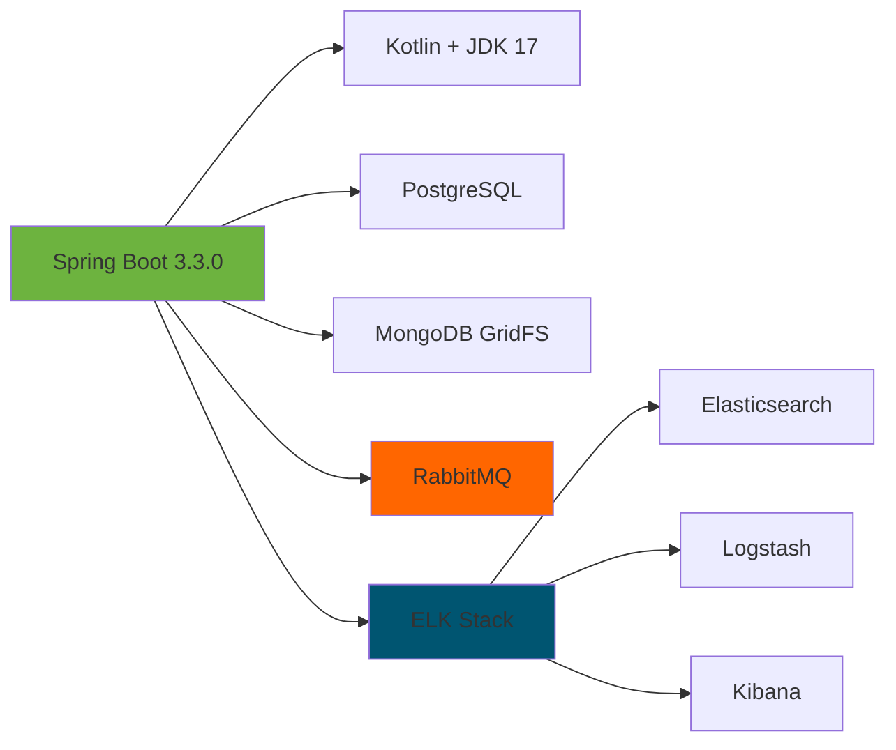

---

## Arquitetura em Camadas (Clean Architecture + DDD)

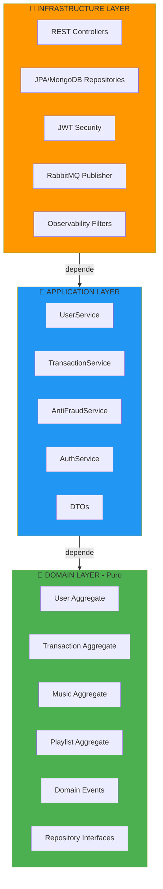

**Princípio**: Dependências sempre apontam para dentro. Domain é puro, sem frameworks.

---

## Event Storm - Identificação de Domínios

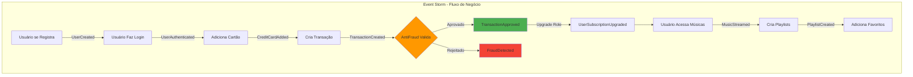

### Domínios Identificados (5 Bounded Contexts)

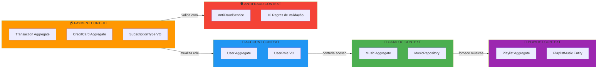

---

## Context Map - Relacionamentos entre Contextos

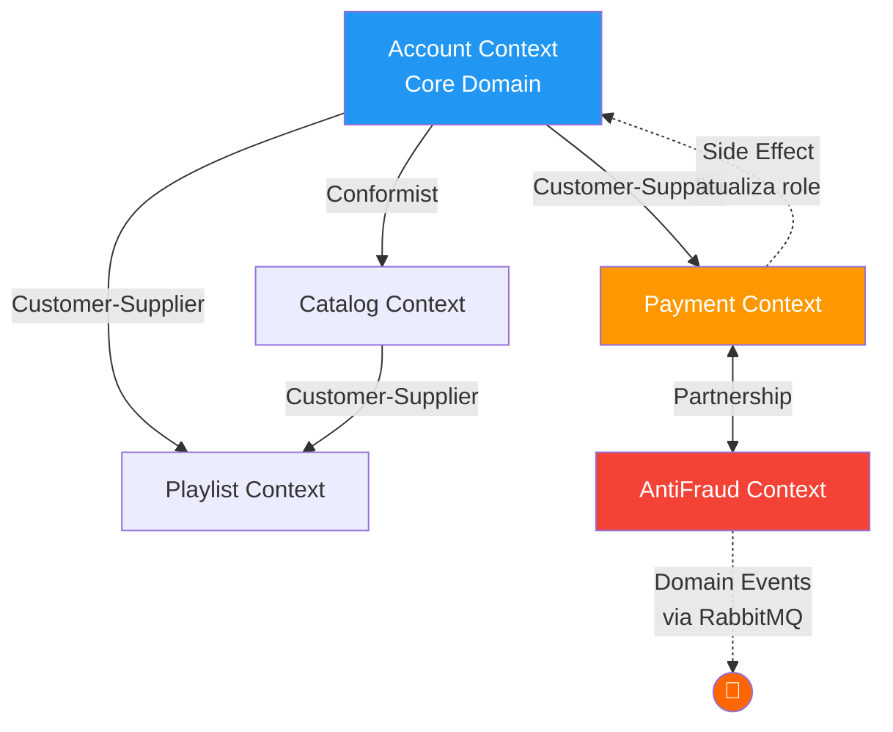

**Padrões Aplicados**:
- **Customer-Supplier**: Account fornece dados para Payment/Playlist
- **Partnership**: Payment e AntiFraud colaboram bidirecionalmente
- **Conformist**: Catalog se conforma às regras de UserRole do Account
- **Domain Events**: Comunicação assíncrona via RabbitMQ

---

## Aggregate Root - Domain Events

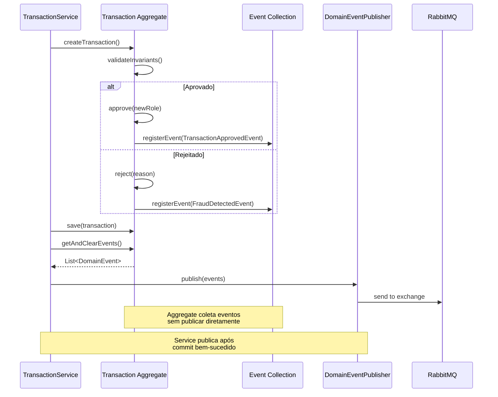

### Exemplo de Aggregate Root

```kotlin
@Entity
class Transaction(
    val userId: UUID,
    val amount: BigDecimal,
    var status: TransactionStatus = PENDING
) : AggregateRoot() {

    // ✅ Método de domínio rico: protege invariantes + registra evento
    fun approve(newUserRole: UserRole) {
        require(status == PENDING) { "Only pending can be approved" }

        status = APPROVED
        registerEvent(
            TransactionApprovedEvent(
                transactionId = id,
                userId = userId,
                newUserRole = newUserRole
            )
        )
    }
}
```

**Base Class**:
```kotlin
abstract class AggregateRoot {
    @Transient
    private val domainEvents = mutableListOf<DomainEvent>()

    protected fun registerEvent(event: DomainEvent) {
        domainEvents.add(event)
    }

    fun getAndClearEvents(): List<DomainEvent> {
        val events = domainEvents.toList()
        domainEvents.clear()
        return events
    }
}
```

---

## Domain Events via RabbitMQ

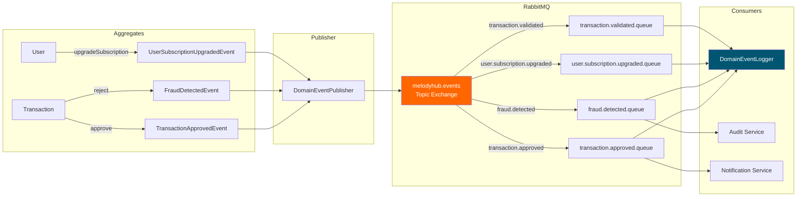

**Routing Keys**:
- `transaction.approved` → TransactionApprovedEvent
- `fraud.detected` → FraudDetectedEvent
- `user.subscription.upgraded` → UserSubscriptionUpgradedEvent
- `transaction.validated` → TransactionValidatedEvent

---

## Anti-Fraud Service - 10 Regras de Validação

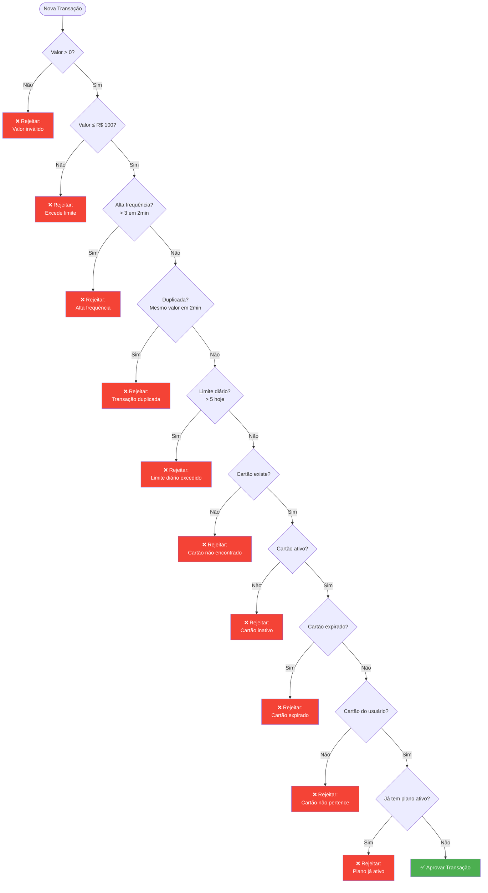

---

## Observabilidade - Sistema de Logs por Camada DDD

```mermaid
graph TB
    subgraph Domain["🎯 DOMAIN LAYER"]
        D1[User.upgradeSubscription]
        D2[Transaction.approve]
        D3[Transaction.reject]
        D1 -.->|registra| E1[Domain Events]
        D2 -.->|registra| E1
        D3 -.->|registra| E1
    end

    subgraph Application["💼 APPLICATION LAYER"]
        A1[TransactionService:<br/>logger.info creation]
        A2[AntiFraudService:<br/>logger.warn violations]
        A3[AuthService:<br/>logger.info login attempts]
        A4[UserContextEnricher:<br/>enrichWithUserContext]
    end

    subgraph Infrastructure["🔧 INFRASTRUCTURE LAYER"]
        I1[MdcFilter:<br/>traceId, requestUri]
        I2[RequestLoggingFilter:<br/>HTTP req/res, latency]
        I3[DomainEventLogger:<br/>@RabbitListener]
    end

    subgraph Logback["📝 LOGBACK"]
        L1[JSON Encoder]
        L2[Async Appender]
        L3[/var/log/melodyhub/melodyhub.json]
    end

    subgraph ELK["📊 ELK STACK"]
        E2[Logstash:<br/>parse, tag, enrich]
        E3[Elasticsearch:<br/>index melodyhub-*]
        E4[Kibana:<br/>visualize, search]
    end

    E1 -->|publicado via RabbitMQ| I3
    A1 --> L1
    A2 --> L1
    A3 --> L1
    I1 --> L1
    I2 --> L1
    I3 --> L1

    L1 --> L2
    L2 --> L3
    L3 --> E2
    E2 --> E3
    E3 --> E4

    style Domain fill:#4CAF50,color:#fff
    style Application fill:#2196F3,color:#fff
    style Infrastructure fill:#FF9800,color:#fff
    style ELK fill:#005571,color:#fff
```

### Componentes de Observabilidade

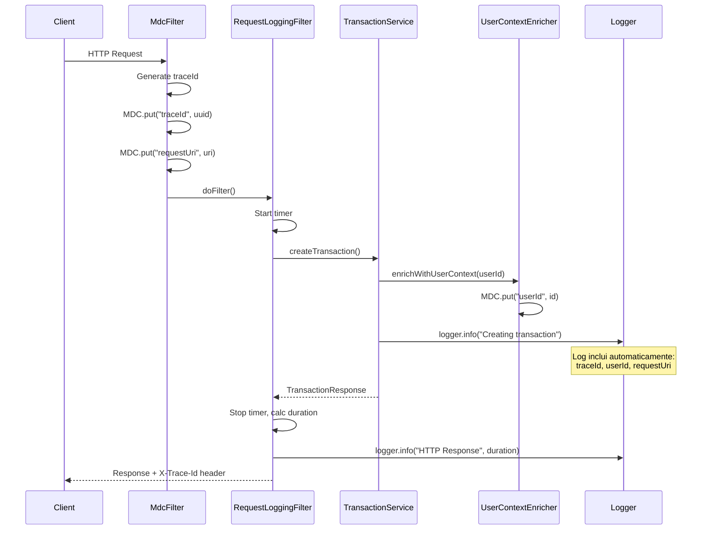

### MDC Context - Campos Automáticos

Todos os logs incluem via MDC (Mapped Diagnostic Context):

```json
{
  "traceId": "550e8400-...",
  "userId": "660e8400-...",
  "userEmail": "test@test.com",
  "userRole": "PREMIUM",
  "transactionId": "770e8400-...",
  "musicId": "ObjectId(...)",
  "playlistId": "880e8400-...",
  "eventType": "TransactionApproved",
  "requestUri": "/api/transactions",
  "requestMethod": "POST"
}
```

---

## Repository Pattern - Inversão de Dependência

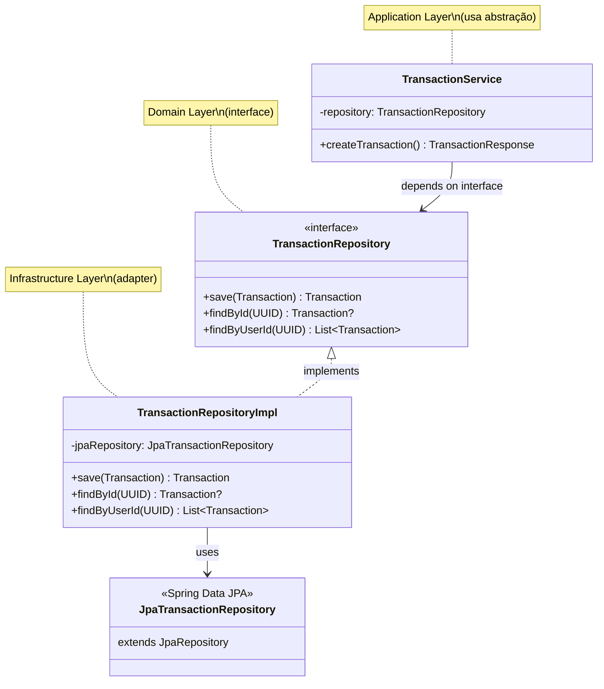

**Benefício**: Domain não conhece JPA. Fácil trocar para MongoDB, Redis, etc.

---

## Estrutura de Diretórios (DDD)

```
src/main/kotlin/edu/infnet/melodyhub/
│
├── domain/                           # 🎯 DOMAIN LAYER
│   ├── shared/
│   │   ├── AggregateRoot.kt         # Base class
│   │   └── DomainEvent.kt
│   ├── events/
│   │   ├── TransactionApprovedEvent.kt
│   │   ├── FraudDetectedEvent.kt
│   │   └── UserSubscriptionUpgradedEvent.kt
│   ├── user/
│   │   ├── User.kt                  # Aggregate Root
│   │   ├── UserRole.kt              # Value Object
│   │   └── UserRepository.kt        # Interface
│   ├── transaction/
│   │   ├── Transaction.kt
│   │   ├── SubscriptionType.kt
│   │   └── TransactionRepository.kt
│   ├── music/
│   │   ├── Music.kt
│   │   └── MusicRepository.kt
│   └── playlist/
│       ├── Playlist.kt
│       └── PlaylistRepository.kt
│
├── application/                      # 💼 APPLICATION LAYER
│   ├── user/
│   │   ├── UserService.kt
│   │   └── dto/
│   ├── transaction/
│   │   ├── TransactionService.kt
│   │   ├── AntiFraudService.kt      # Domain Service
│   │   └── dto/
│   ├── auth/
│   │   ├── AuthService.kt
│   │   └── dto/
│   └── music/
│       ├── MusicService.kt
│       └── dto/
│
└── infrastructure/                   # 🔧 INFRASTRUCTURE LAYER
    ├── web/                         # Controllers REST
    │   ├── UserController.kt
    │   ├── TransactionController.kt
    │   └── MusicController.kt
    ├── user/
    │   ├── JpaUserRepository.kt     # Spring Data
    │   └── UserRepositoryImpl.kt    # Adapter
    ├── security/
    │   ├── JwtService.kt
    │   └── SecurityConfig.kt
    ├── events/
    │   └── DomainEventPublisher.kt  # RabbitMQ
    └── observability/
        ├── MdcFilter.kt
        ├── RequestLoggingFilter.kt
        ├── UserContextEnricher.kt
        └── DomainEventLogger.kt
```

---

## Bancos de Dados - Dual Database

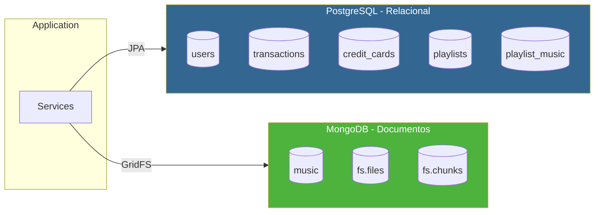

**PostgreSQL**: Dados relacionais (usuários, transações, playlists)
**MongoDB GridFS**: Arquivos de áudio > 16MB (MP3, FLAC, AAC)

---

## Autenticação JWT - Flow

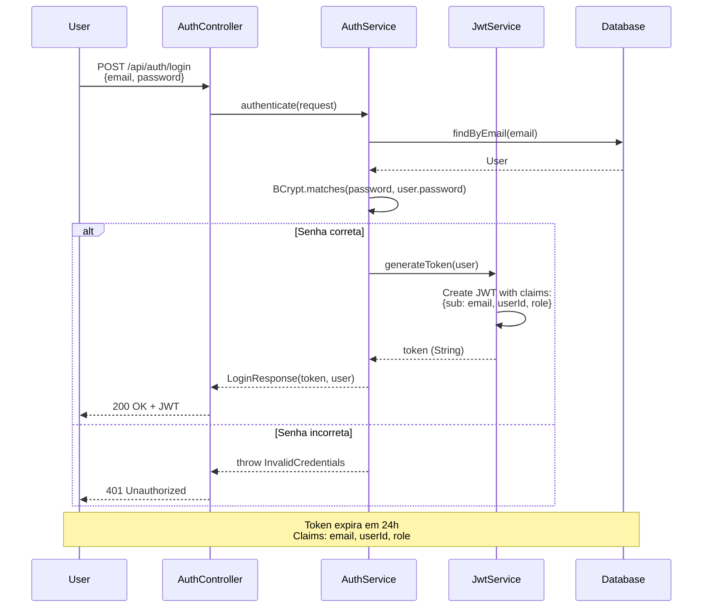

**Claims JWT**:
```json
{
  "sub": "user@example.com",
  "userId": "550e8400-...",
  "role": "PREMIUM",
  "iat": 1700000000,
  "exp": 1700086400
}
```

---

## Controle de Acesso - Music Permissions

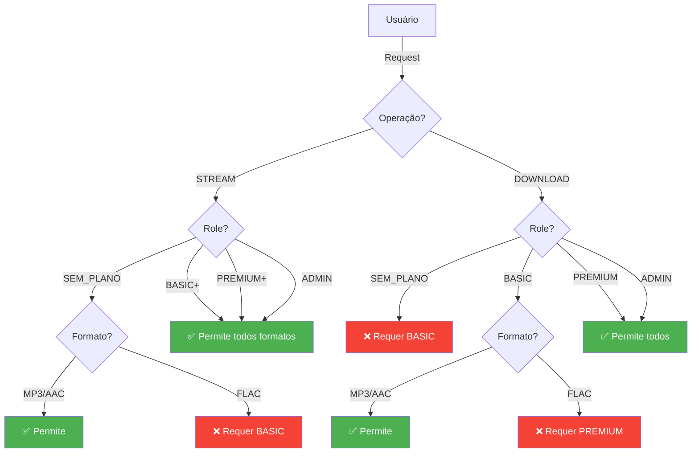

| Role | Stream MP3/AAC | Stream FLAC | Download MP3/AAC | Download FLAC | Upload |
|------|----------------|-------------|------------------|---------------|--------|
| SEM_PLANO | ✅ | ❌ | ❌ | ❌ | ❌ |
| BASIC | ✅ | ✅ | ✅ | ❌ | ❌ |
| PREMIUM | ✅ | ✅ | ✅ | ✅ | ❌ |
| ADMIN | ✅ | ✅ | ✅ | ✅ | ✅ |

---

## Docker Compose - Ambiente Completo

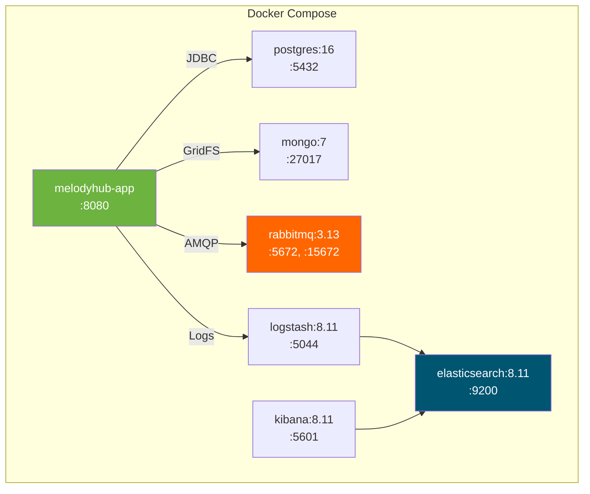

**Services**:
- `app`: Aplicação Spring Boot (porta 8080)
- `postgres`: Banco relacional (porta 5432)
- `mongo`: Banco de documentos (porta 27017)
- `rabbitmq`: Mensageria (portas 5672 AMQP, 15672 Management UI)
- `elasticsearch`: Indexação de logs (porta 9200)
- `logstash`: Processamento de logs (porta 5044)
- `kibana`: Visualização de logs (porta 5601)

---

## Padrões DDD Implementados

| Padrão | Implementação | Exemplo |
|--------|---------------|---------|
| **Aggregate** | User, Transaction, Music, Playlist | `Transaction` com métodos `approve()`, `reject()` |
| **Aggregate Root** | Base class com eventos | `AggregateRoot.registerEvent()` |
| **Value Object** | Enums imutáveis | `UserRole`, `SubscriptionType`, `TransactionStatus` |
| **Repository** | Interface no domain, adapter na infra | `TransactionRepository` (interface) → `TransactionRepositoryImpl` |
| **Domain Service** | Lógica que não pertence a um aggregate | `AntiFraudService` (10 regras de validação) |
| **Domain Event** | Eventos de negócio | `TransactionApprovedEvent`, `FraudDetectedEvent` |
| **Factory** | Métodos de criação | `TransactionResponse.from(transaction)` |
| **Anti-Corruption Layer** | DTOs separando domain de API | `CreateTransactionRequest` → `Transaction` → `TransactionResponse` |
| **Ubiquitous Language** | Nomes do domínio | `approve()`, `reject()`, `validateTransaction()`, não `setStatus()` |

---

## Testes - Cobertura > 80%

**29 arquivos de teste** cobrindo todas as camadas:

```
src/test/kotlin/
├── domain/
│   ├── AggregateRootTest.kt
│   ├── TransactionTest.kt
│   ├── UserTest.kt
│   ├── PlaylistTest.kt
│   └── DomainEventsTest.kt
├── application/
│   ├── TransactionServiceTest.kt
│   ├── AntiFraudServiceTest.kt    # Testa 10 regras
│   ├── AuthServiceTest.kt
│   └── UserServiceTest.kt
└── infrastructure/
    ├── TransactionControllerTest.kt
    ├── UserControllerTest.kt
    ├── JwtServiceTest.kt
    └── ...
```

**Ferramentas**:
- JUnit 5
- Mockito Kotlin
- JaCoCo (cobertura)

**Comando**:
```bash
./gradlew test jacocoTestReport
# Relatório: build/reports/jacoco/test/html/index.html
```

---

## Comandos Úteis

```bash
# Iniciar ambiente completo
docker-compose up --build

# Logs da aplicação
docker-compose logs -f app

# Acessar serviços
open http://localhost:8080        # API
open http://localhost:5601        # Kibana
open http://localhost:15672       # RabbitMQ Management

# Criar usuário
curl -X POST http://localhost:8080/api/users \
  -H "Content-Type: application/json" \
  -d '{"name":"Test","email":"test@test.com","password":"senha123"}'

# Login (obter JWT)
curl -X POST http://localhost:8080/api/auth/login \
  -H "Content-Type: application/json" \
  -d '{"email":"test@test.com","password":"senha123"}'

# Rodar testes
./gradlew test

# Gerar relatório de cobertura
./gradlew jacocoTestReport
```

---

## Queries no Kibana

**Eventos de domínio**:
```
tags: "domain_event"
```

**Fraudes detectadas**:
```
eventType: "FraudDetected"
```

**Rastrear requisição por trace ID**:
```
traceId: "550e8400-e29b-41d4-a716-446655440000"
```

**Transações de um usuário**:
```
userId: "660e8400-..." AND tags: "transaction"
```

**Requisições lentas (> 1 segundo)**:
```
message: "HTTP Response" AND duration > 1000
```

---

## Boas Práticas DDD

### ✅ Rich Domain Model
Aggregates contêm lógica, não são anêmicos:
```kotlin
transaction.approve(newRole)  // ✅ Método de negócio
// transaction.status = APPROVED  ❌ Não expõe setter
```

### ✅ Ubiquitous Language
Nomes refletem linguagem do domínio:
- `approve()` não `setStatusApproved()`
- `validateTransaction()` não `check()`

### ✅ Invariantes Protegidos
```kotlin
fun approve(newUserRole: UserRole) {
    require(status == PENDING) { "Only pending can be approved" }
    // ...
}
```

### ✅ Domain Puro
Domain Layer não depende de frameworks:
- Sem Spring annotations em Aggregates
- Sem logging direto
- Repository como interface

### ✅ Eventos para Comunicação
Contextos se comunicam via eventos, não chamadas diretas:
```
Payment publica TransactionApprovedEvent
    ↓ RabbitMQ
Account consome e atualiza User.role
```
